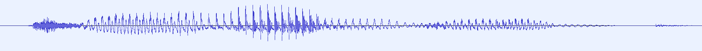
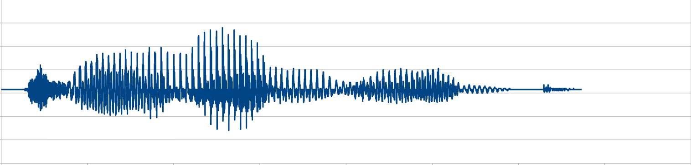

# image-sound-sample
Sampling audio with images 

## This code will take a screenshot of an audio sample and get the boundary points of its graph; 
## Then it will reconstruct the audio sample in a wav file; 

# Audio Sample: 
 

# Reconstructed Audio: 

